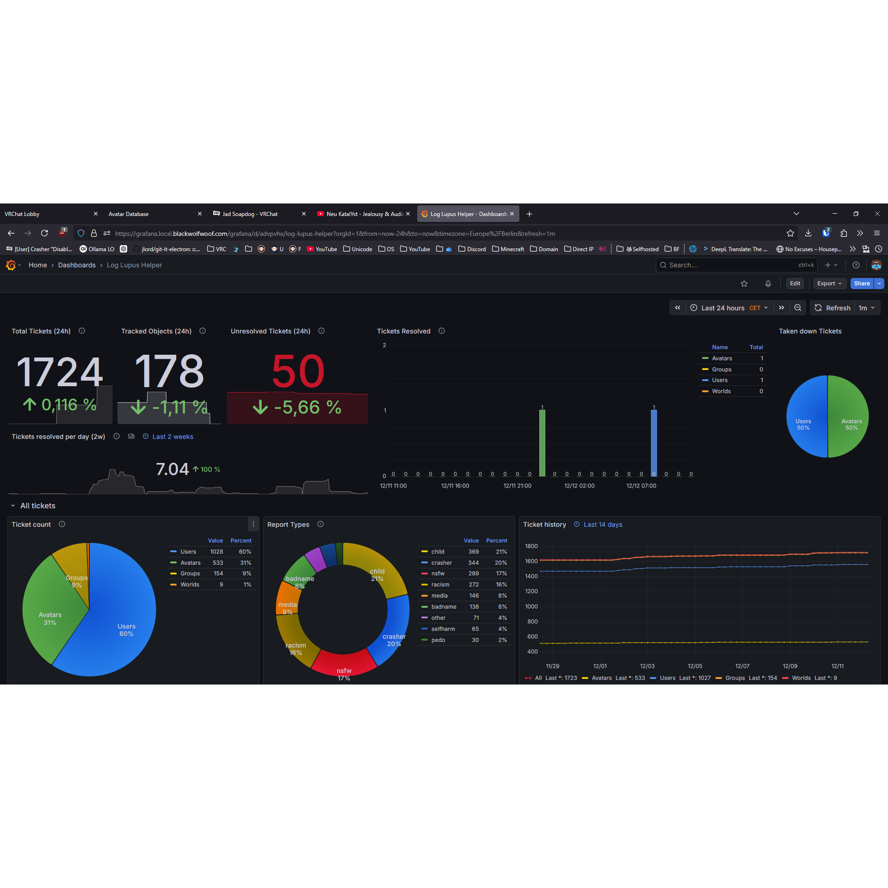
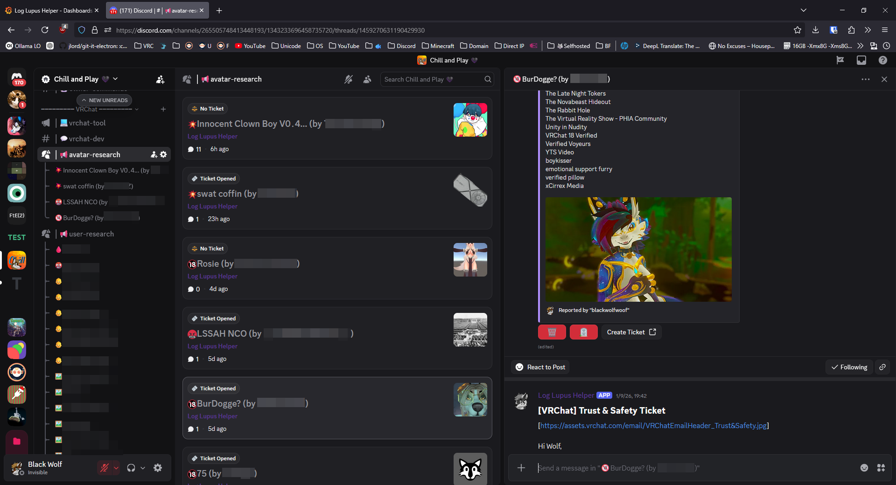

# Log Lupus Helper
> A Helper bot for managing VRChat tickets

## Index:

1. [Description](#Description)
2. [Installation](#Installation)
3. [Misc](#Misc)


## Description:
The combination of a Discord Bot, VRChat credentials, a Zendesk VRChat account, IMAP credentials and optionally an export for Prometheus and Grafana, gives you the ability to track the status of your ticket.<br>
It does this
- the individuals for being terminated
- pre-filling your ticket, so you can submit them quicker
- access to your email account, so replies from VRChat get neatly organized to each report for the discord thread
- a data endpoint for prometheus and grafana

## Installation:
You need Docker, a VRChat account and it's credentials (2FA must be enabled, the seed will be needed), an email account with IMAP access, VRChat Zendesk account.<br>
Fill out the `example.env` file with all the data, and rename it to `.env`.
Now you can run `docker compose up -d` and this will build the package and install everything needed. If you still have any issues, feel free to each out to me via email or my Discord Server.<br>
Make sure that for the mail provider you use, you set up a filter to automatically put the emails into the `Archive` folder.<br>

For Prometheus this is the config i used:
```yml
# Testing for log lupus helper
- job_name: log_lupus_helper
  scrape_interval: 1m
  static_configs:
    - targets: ['log-lupus-helper:8901']
```
For Grafana, check grafana.yml, which is a dashboard you can import.<br>
This can run without docker, but installation of the packets need to be handeled manually.

## Misc:
